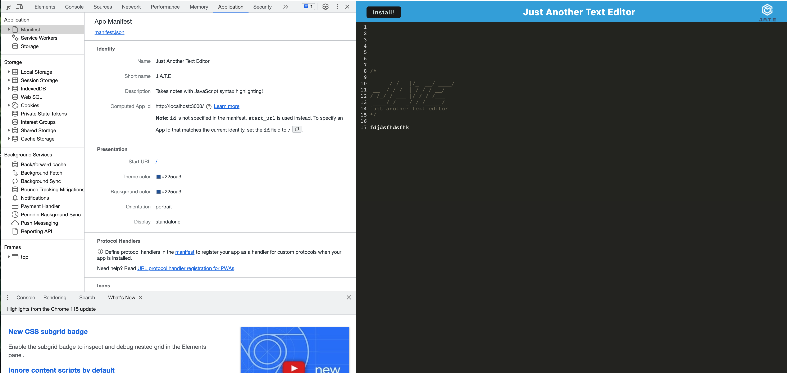
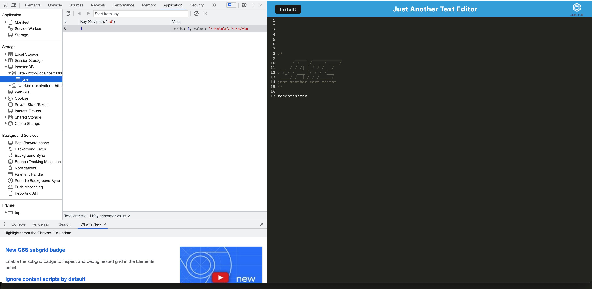

<div align="center">
<h1>
<span style="color:gold">PWA Text Editor</span> 

</h1>
<h2> Progressive Web Applications (PWA): Text Editor </h2>
<h2>Technologies Used</h2>


[](https://opensource.org/licenses/MIT) 
 [](code_of_conduct.md)
  
</div>

## Table of Contents

- [Description](#description)

- [User-Story](#user-story)

- [Live-URL](#live-url)

- [Screenshots](#screenshots)

- [Installation](#installation)

- [Tests](#tests)

- [Contribution-Guidelines](#contribution-guidelines)

- [License](#license)

- [Credits](#credits)

- [Questions](#questions)

## Description 
This is a text editor application. The text editor runs in a browser and can be installed on a computer. It utilizes webpack, service-worker, express, javascript, css, and html.

## User Story

```md
AS A developer
I WANT to create notes or code snippets with or without an internet connection
SO THAT I can reliably retrieve them for later use
```

## Live-URL

[Deployed Page with Heroku](https://desolate-castle-58883-0c04e5069073.herokuapp.com/)

## Screenshots

<div align="center">







</div>
  
## Installation 

Users can view and utilize the application through the use of the browser by visiting the deployed application at https://heroku.com
Viewing the application in the browser will also give users the ability to download the application allowing it to be used offline.


## Tests
There are currently no unit testings written for this application.

## Contribution-Guidelines
Please follow Contributor Covenant Guidelines by clicking on the following link: 
*[Contributor Covenant](https://www.contributor-covenant.org/)*

## License
This project is covered under the MIT licence.  
To learn more click on the following *[link](https://opensource.org/licenses/MIT)*

##  Credits

Starter code was given for this challange and code is based on mini project and some other modules from bootcamp. I worked with a tutor, Drew Sanches who also helped me finalize my project. 

## Questions
Please visit my [GitHub Repo](https://github.com/Esztergb/text-editor) to view this project.
[Deployed Page](https://desolate-castle-58883-0c04e5069073.herokuapp.com/)


